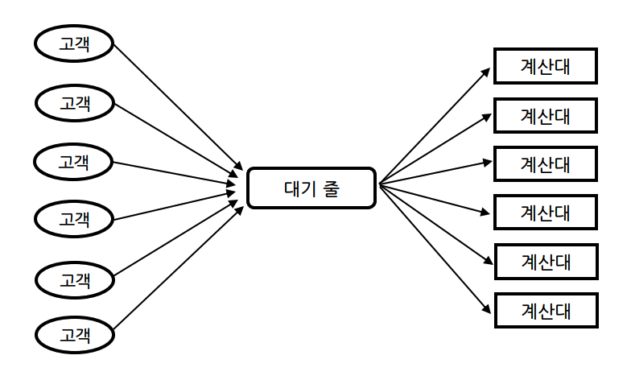
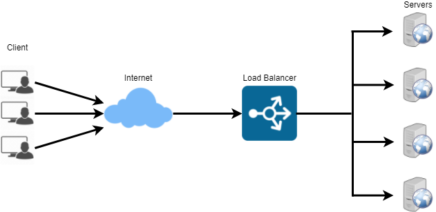
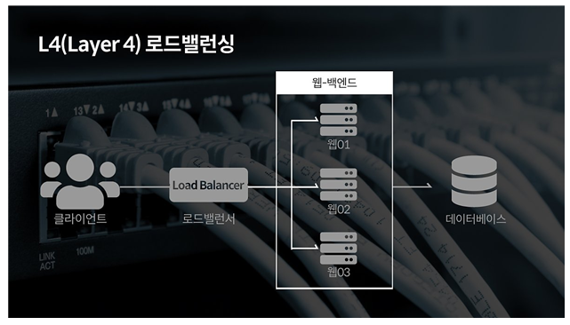
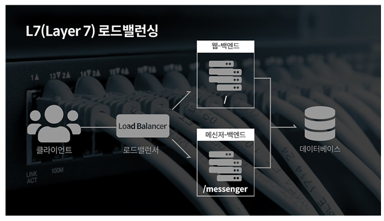

# Load Balancing

### 1. 로드 밸런싱 개념
로드 밸런싱(Load Balancing)은 컴퓨터 네트워크 기술의 일종으로, 부하 분산이라고도 한다. 이는 애플리케이션을 지원하는 리소스 풀 전체에 네트워크 트래픽을 균등하게 배포하는 방법이다. 쉽게 말해 서버가 처리해야 할 작업이나 요청을 여러 대의 서버로 분산하여 부하를 낮춰 처리하는 기술이다. 보통 트래픽이 많은 웹 사이트, FTP 사이트, NNTP 서버, DNS 서버 등에서 적용된다.

우리가 대형 마트에 갔을 때 계산대가 하나만 존재한다면 어떨까? 계산하려는 많은 사람들이 모이면서 일을 처리하는 속도가 굉장히 느려질 것이다. 하지만 계산대가 여러 개 존재하면 계산 업무를 적절히 배분하여 효율적으로 진행할 수 있게 된다.

혹은 새로 발매한 게임에 갑자기 많은 사용자가 몰린다면 어떻게 될까? 아마 서버는 죽고 제대로 된 게임을 즐길 수 없을 것이다. 역시 서버를 나눠 클라이언트 요청을 적절히 분배하면 안정적인 게임 서비스가 가능할 것이다.

  

  

최신 웹 서비스나 애플리케이션은 수많은 사용자들의 요청을 동시에 처리하고, 안정적인 방식으로 각 사용자에게 반환해야 한다. 이렇게 많은 양의 트래픽을 처리하기 위해 대부분은 데이터가 중복되는 리소스 서버가 존재한다. 이는 클라이언트와 서버 사이에 위치한 '로드 밸런서(Load Balancer)'에 의해 처리되며, 모든 리소스 서버가 균등하게 사용되도록 도와준다.

  

  

결국 위 그림처럼 수많은 클라이언트의 요청을 효율적으로 처리하기 위해 로드 밸런싱 기술을 적용한다. 서버의 부하를 나눠 클라이언트에 대한 서버 가용성 및 응답시간을 최적화시킬 수 있다. 클라이언트가 증가함에 따라 서버 또한 감당해야할 트래픽이 많아질 것이다. 따라서 장비(서버)를 업그레이드해야하며, 대표적으로 'Scale-up' 방식과 'Scale-out' 방식이 있다.

 

먼저 Scale-up은 하나의 서버 자체 성능을 확장하는 것을 의미한다. 예를 들어 500ml 용량을 가진 컵이 있는데 더 많은 액체를 담고 싶다면 1L 컵으로 교체하면 된다. 따라서 이 경우엔 크게 문제가 되지 않는다. 하지만 실제로 서버의 성능을 업그레이드하는데엔 한계가 있기 때문에 Scale-out 방식도 고려해야 한다.
 
Scale-out은 기존 서버와 동일하거나 더 낮은 서버를 두 대 이상 늘리는 것을 말한다. 위 예시에 빗대면 더 많은 액체를 담기 위해 500ml 컵의 개수를 늘리는 것이다. 만약 900ml 의 액체를 담기 위해 컵을 늘린다고 하자. 500ml 컵 2개가 되었다. 이후 적절한 분배를 통해 액체를 담아야 하는데 700ml, 200ml 로 나눠 담는다면 첫 번째 컵은 액체가 흘러 넘칠 것이다. 만약 450ml, 450ml 로 동일하게 나눠 각 컵에 담는다면 900ml 를 모두 담을 수 있을 것이다.

즉, 로드 밸런싱은 둘 이상의 서버에 대한 대규모 네트워크 트래픽을 분산 처리하는 기술이다. 그리고 로드 밸런서는 특정 서버에 부하가 집중되지 않도록 다양한 방법을 통해 트래픽을 분산시켜 서버의 성능을 최적화한다.

---

### 2. 로드 밸런싱 주요 기능

#### 1. 상태 확인 (Health Check)
로드 밸런서는 등록된 서버의 상태를 주기적으로 확인하여 장애 여부를 판단할 수 있다. 이를 통해 정상적인 서비스쪽으로 부하를 분산하고, 비정상적인 서비스는 서비스 그룹에서 제외하여 트래픽을 보내지 않는다. 상태 확인에는 여러 가지 방법이 있다.

- L3 체크 : 네트워크 계층을 사용, VIP에 연결된 서버에 대해 ICMP를 이용해 서버 IP 주소가 통신 가능한 상태인지 확인한다. 하지만 서버가 살아있는지만 체크하는 방법이기 때문에 자주 사용되지는 않는다.
- L4 체크 : 전송 계층을 사용, TCP 연결 과정인 3-way handshake 의 특성을 통해 각각의 포트 상태를 확인한다.
- L7 체크 : 애플리케이션 계층을 사용, 실제 웹사이트에 통신을 시도하여 장애 여부를 판단한다.
  

#### 2. NAT (Network Address Translation)
내부 네트워크에서 사용하는 사설 IP 주소와 외부에서 사용하는 공인 IP 주소간 변환 기능이다. 양쪽 방향 모두 가능하며, 여러 개의 호스트가 하나의 공인 IP 주소를 통해 접속할 수 있도록 한다. 
 SNAT(Source Network Address Translation)은 내부에서 외부로 트래픽이 나가는 경우 사설 IP 주소 -> 외부 IP 주소로, DNAT(Destination Network Address Translation)은 외부에서 내부로 트래픽이 들어오는 경우 외부 IP 주소 -> 사설 IP 주소로 변환하는 것을 말한다.
  

#### 3. 터널링 (Tenneling)
터널링은 데이터 스트림을 인터넷 상에서 가상의 파이프를 통해 통신하는 기술로, 데이터를 캡슐화해 연결된 상호 간에만 캡슐화된 패킷을 구별, 해제할 수 있도록 한다.
  

#### 4. DSR (Direct Service Return)
만약 서버에서 클라이언트로 되돌아갈 경우, 로드 밸런서를 거치지 않고 서버에서 클라이언트로 직접 응답 패킷을 전달하는 것이다. 
이를 통해 로드 밸런서의 부하를 줄일 수 있다.

---

### 3. 로드 밸런싱 종류

#### 1) L4 로드 밸런싱
L4 로드 밸런서는 L4 계층에서 동작하는 로드 밸런서이다. 따라서 네트워크 계층이나 전송 계층의 정보인 IP, TCP, UDP 등의 정보로 부하를 분산한다. 즉, IP 주소나 포트 번호, MAC 주소, 전송 프로토콜 등을 바탕으로 트래픽을 나누는 것이 가능하다. 다음은 장점과 단점이다.

- 장점 : 패킷의 내용을 확인하지 않고 부하를 분산하므로 속도가 빠르고 효율적이다. 데이터의 내용을 복호화할 필요가 없기 때문에 비교적 안전하다. L7 로드 밸런서보다 가격이 낮다.
- 단점 : 패킷의 내용을 살펴볼 수 없기 때문에 섬세한 라우팅이 불가하다. 사용자의 IP 주소가 자주 바뀐다면, 연속적인 서비스를 제공하기 어렵다.

다음은 L4 로드 밸런싱에 사용되는 방식이다.

1. 라운드 로빈 방식 (Round Robin Method) : 세션을 각 서버에 순서대로 돌아가며 맺어주는 방식이다. 단순히 순서에 따라 세션을 할당하므로 경로별로 동일한 처리량이 보장되지 않는다. 이러한 특징 때문에 동일한 스펙의 서버에서 서버와의 연결이 오래 지속되지 않을 경우 적합하다.
  

2. 가중치 라운드 로빈 방식 (Weighted Round Robin Method) : 각각의 서버마다 비율을 설정해 두고 해당 비율만큼 세션을 맺어주는 방식이다. 즉, 서버마다 가중치를 매기고 가중치가 높은 서버에 트래픽을 우선적으로 배분한다. 이는 서버의 트래픽 처리 능력이 상이할 경우 적합하다.
  

3. 최소 연결 방식 (Least Connection Method) : 가장 많이 사용되는 방식으로, 요청이 들어온 시점에 가장 적은 세션을 가진 서버로 트래픽을 보내는 방식이다. 세션이 자주 길어지거나, 서버에 분산된 트래픽들이 일정하지 않을 경우 적합하다.
  

4. 최소 응답 시간 방식 (Least Response Time Method) : 가장 빠른 응답 시간을 보내는 서버로 먼저 트래픽을 보내는 방식이다. 서버의 현재 연결 상태와 응답 시간을 고려하며, 각 서버들이 가용할 수 있는 리소스와 성능, 처리중인 데이터 양이 상이할 경우 적합하다.
  

5. IP 해시 방식 (IP Hash Method) : 클라이언트의 IP 주소를 특정 서버로 매핑하여 요청을 처리하는 방식이다. 특정 클라이언트는 특정 서버로만 할당되어 세션이 맺어진다. 경로가 보장되며, 접속자 수가 많을수록 분산 및 효율이 뛰어나다.
  

6. 대역폭 방식 (Bandwidth Method) : 서버들과의 대역폭을 고려하여 트래픽을 분산하는 방식이다.
   

#### 2) L7 로드 밸런싱
L7 로드 밸런서는 L4 로드 밸런서의 기능을 포함하며, OSI 7계층의 프로토콜 (HTTP, SMTP, FTP 등)을 바탕으로도 분산 처리가 가능하다. 다음은 장점과 단점이다.

- 장점 : 상위 계층에서 부하를 분산하기 때문에 섬세한 라우팅이 가능하다. 캐싱 기능을 제공하며 비정상적인 트래픽을 사전에 필터링할 수 있어서 서비스 안정성이 높다.
- 단점 : L4 로드 밸런서에 비해 가격이 높다. 또한 패킷의 내용을 복호화해야 하기에 더 많은 비용이 든다. 클라이언트가 로드 밸런서와 인증서를 공유해야 하기 때문에, 공격자가 로드 밸런서를 통해 클라이언트의 데이터에 접근할 수 있는 보안상의 위험이 있다.

다음은 L7 로드 밸런싱에 사용되는 방식이다.

1. URL 스위칭 방식 (URL Switching Method) : 특정 하위 URL들을 특정 서버로 처리하는 방식이다. 특정 주소들은 서버가 아닌 별도의 스토리지에 있는 객체 데이터로 바로 연결되도록 구성할 수 있다.
  

2. 컨텍스트 스위칭 방식 (Context Switching Method) : 클라이언트가 요청한 특정 리소스에 대해 특정 서버 등으로 연결할 수 있다.
  

3. 쿠키 지속성 (Persistence with Cookies) : 쿠키 정보를 바탕으로 클라이언트가 연결했던 동일 서버에 계속 할당해주는 방식이다. 특히 사설 네트워크의 클라이언트 IP 주소가 공인 IP 주소로 변환되어 전송하는 방식을 지원한다.
   

#### 3) L4 로드 밸런서 vs L7 로드 밸런서

|   |
L4 로드 밸런서|L7 로드 밸런서|
|:---:|:---|:---|
|네트워크 계층|
전송 계층(Transport Layer) : Layer4 4|
응용 계층 (Application Layer) : Layer 7|
|특징|
TCP/UDP 포트 정보를 바탕으로 동작|TCP/UDP 정보는 물론 HTTP의 URI, SMTP, FTP의 파일명, 쿠키 정보 등을 바탕으로 동작|
|장점|1. 데이터 안을 들여다 보지 안고 패킷 레벨에서만 트래픽을 분산하기 때문에 속도가 빠르고 효율이 좋음 2. 데이터의 내용을 복호화할 필요가 없어 안전함 3. L7 로드 밸런서보다 가격이 저렴함|1.상위 계층에서 트래픽을 분산하기 때문에 훨씬 섬세한 라우팅 가능  2. 캐싱 기능 제공 3. 비정상적인 트래픽을 사전에 필터링하여 서비스 안정성이 높음|
|단점|1. 패킷의 내용을 볼 수 없기에 섬세한 라우팅 불가 2. 사용자 IP 주소가 자주 바뀌면 연속적인 서비스 제공이 어려움|1. 패킷의 내용을 복호화해야하기 때문에 비용이 높음 2. 클라이언트가 로드밸런서와 인증서를 공유하기 때문에 공격자가 클라이언트의 데이터에 접근 가능함. 따라서 보안 상의 위험이 존재함.|

---
  
### 4. 로드 밸런서 주요 성능 지표

1) 초당 연결 수 (Connections per second) : 초당 처리 가능한 최대 TCP 세션 개수
2) 동시 연결 수 (Concurrent Connections) : 세션을 동시에 유지할 수 있는 최대 개수
3) 처리 용량 (Throughput) : UDP 프로토콜에 대한 로드 밸런싱 성능 지표. 단위는 bps(bit per second) or pps (packet per second) 사용

