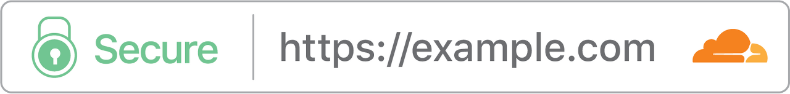
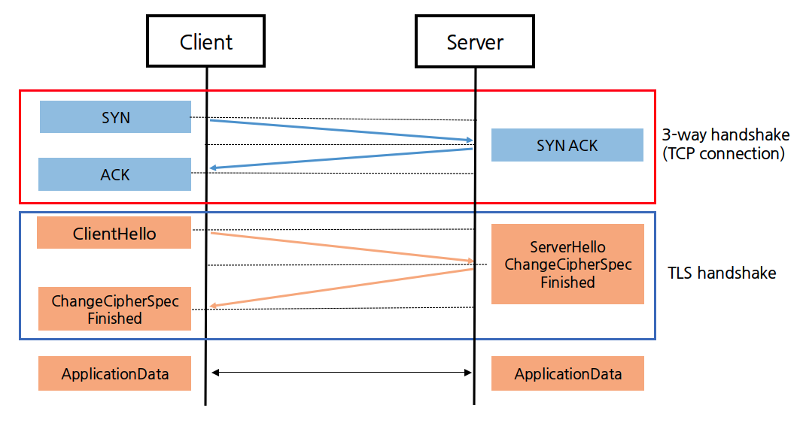

## SSL/TLS

### 1. SSL/TLS

#### 1) SSL (Secure Sockets Layer)
SSL 은 보안 소켓 계층' 이라고 불리는 암호화 기반 인터넷 프로토콜이다. 1995년 Netscape 사에서 처음 개발되었으며, 인터넷 통신에서 개인 정보 보호, 인증, 데이터 무결성을 보장한다. 즉, 네트워크상의 두 디바이스 또는 애플리케이션 간에 보안 연결을 생성한다.

SSL은 'Certificate Authority (CA)' 라는 디지털 인증서 발급 엔티티로부터 클라이언트와 서버의 인증을 하는데 사용된다.

특히 OSI 7계층 중 전송계층(4계층)과 응용계층(7계층) 사이에서 보안 관련 역할을 수행한다. 하지만 SSL은 오래된 기술이며, 보안적 결함이 몇몇 발견되어 현재는 이를 개선한 TLS를 사용한다.
  

#### 2) TLS (Transport Layer Security)
TLS는 '전송 계층 보안' 이라고 불리는 보안 프로토콜이며, SSL의 최종 버전인 3.0과 TLS의 최초 버전의 차이가 크지 않다.

TLS는 웹 브라우저처럼 웹 응용 프로그램과 서버 간의 커뮤니케이션 뿐만 아니라 이메일, 메시지, VoIP 등을 암호화하기 위해 사용한다.

결론적으로 TLS는 SSL의 개선된 버전이며, 명칭만 다르다고 할 수 있다. 그럼에도 완전히 동일하진 않으며, 유사점과 차이점이 존재한다.이러한 SSL/TLS를 사용하는 웹사이트 URL에는 'http://'가 아닌 보안 기술이 적용된 'https://'를 사용한다.
  

#### 3) SSL/TLS 유사점
1. HTTPS 에서 사용
    - HTTP 는 네트워크를 통한 클라이언트 - 서버 간 통신을 위한 규칙이다. 이 위에 보안 기술인 SSL/TLS를 설정하여 HTTPS가 적용된 'https://'로 사용된다.
  
2. 다양한 암호 통신 방법에 활용
    - 대칭 키 암호화, 공개 키 암호화, 일방향 해시 함수, 메시지 인증 코드, 의사 난수 생성기, 전자서명 등을 조합하여 암호화 통신을 수행한다.
  
3. 특정 암호화 기술에 의존하지 않음
    - 암호 도구 목록 (Cipher Suite)을 변경하여 강렬한 알고리즘을 사용한다.
  

#### 4) SSL/TLS 차이점
1. SSL/TLS handshake
    - SSL handshake는 명시적 연결, TLS handshake는 암시적 연결이다. 또한 SSL handshake 프로세스가 많았기에 TL는 추가 단계를 제거하고 총 암호 그룹 수를 줄여 프로세스 속도를 높였다.
  
2. 알림 메시지
    - SSL/TLS는 알림 메시지를 통해 오류와 경고를 전달한다. SSL에는 '경고' 및 '치명적'이라는 두 가지 유형만 존재한다. 경고는 연결을 지속할 수 있으나 치명적 알림은 연결을 즉시 종료해야 한다. 또한 SSL 알림 메시지는 암호화되지 않는다. 반면 TLS에는 세션 종료를 알리는 '닫기 알림'이라는 유형이 추가로 존재하며, 추가 보안을 위해 암호화된다.
  
3. 메시지 인증
    - SSL/TLS 모두 메시지의 기밀성과 무결성 확인을 위해 암호화 기술 중 하나인 메시지 인증 코드(MAC)을 사용한다. SSL은 MAC 생성시 MD5 알고리즘을, TLS는 해시 기반 메시지 인증 코드(HMAC)를 사용한다.
  
4. 암호 그룹
    - 암호 그룹에는 키 교환 알고리즘, 검증 알고리즘, 대량 암호화 알고리즘, MAC 알고리즘 등이 포함된다. SSL은 알려진 보안 취약점이 있는 이전 알고리즘을 지원한다. 이러한 문제로 TLS는 고급 암호화 알고리즘을 사용하도록 개선되었다.
  

 |   |SSL|TLS|
 |:---:|:---:|:---:|
 |의미|Secure Sockets Layer(보안 소켓 계층)|Transport Layer Security(전송 계층 보안)|
 |버전|SSL 1.0, SSL 2.0, SSL 3.0|TLS 1.0, TLS 1.1, TLS 1.2, TLS 1.3|
 |알림 메시지|경고, 치명적 -> 암호화되지 않음|여러 유형 -> 암호화됨|
 |메시지 인증|MAC|HMAC|
 |암호 그룹|보안 취약점이 있는 이전 알고리즘 지원|고급 암호화 알고리즘 지원|
 |핸드셰이크|복잡하고 느림|단계가 적고 연결 속도가 빠름|
   

 #### 5) 필요성
 TLS 암호화 기술은 클라이언트 - 서버 뿐만 아니라 인터넷 통신에서 데이터 유출 및 악의적인 공격으로부터 웹 애플리케이션을 보호할 수 있다. TLS의 필요성은 다음과 같은 이유이다.

1. 기밀성 (Confidentiality) 보장
    - TLS는 통신하는 양쪽 간의 데이터를 암호화하여 제 3자라 정보를 탈취하거나 엿보는 것을 방지하여 기밀성을 보장한다. 특히 금융 거래, 로그인 정보, 개인 메일 등의 데이터는 기밀성을 유지해야 한다.
  
1. 무결성 (Integrity) 보장
    - 데이터 무결성은 데이터가 전송 중에 변경되지 않음을 보장한다. TLS는 데이터의 무결성을 보호하여 중간에 데이터가 수정되거나 손상되는 것을 방지한다. 이는 데이터 전송 중에 발생할 수 있는 공격을 방어하는 데에 중요하다.
  
1. 인증 (Authentication)
    - TLS는 통신 상대방의 신원을 확인하고 검증하는데 사용된다. 이를 통해 사용자가 의도치 않게 피싱 사이트에 접속하는 등 위험을 줄일 수 있다. 즉, 웹 사이트, 서버, 애플리케이션 등의 신원을 확인하여 안전하게 통신하도록 도와준다.
  
1. 보안 표준 준수
    - 많은 규제 기관 및 보안 표준이 데이터의 안전한 전송을 요구한다. TLS는 이러한 규제 및 표준을 준수함으로써 기업이 법적 요구사항을 충족하고, 고객 데이터를 안전하게 유지할 수 있도록 도와준다.
  
---
  

## SSL/TLS handshake

### 1. 개념

#### 1) SSL/TLS handshake
SSL (Secure Sockets Layer) 이 발전하여 TLS (Transport Layer Security) 가 되었다. SSL 은 3.0 버전을 최종으로 더이상 나오지 않으며, 현재는 대부분 TLS를 사용하기 때문에 이제부터 TLS handshake 라고 하겠다.
 
'Handshake'란 말 그대로 악수를 뜻한다. 네트워크에서 이는 클라이언트와 서버간의 통신을 의미하며, 연결적 요소를 가진다. 

handshake 를 사용하는 또 다른 용어로는 '3-way handshake', '4-way handshake'가 있다. 이 둘은 클라이언트와 서버가 연결되는 과정이다. 이와 관련된 부분은 다른 글에서 보다 자세히 다루도록 하겠다.

TLS handshake는 통신을 하는 클라이언트와 서버가 서로 암호화 통신을 시작할 수 있도록 신분을 확인하고 필요한 정보를 주고 받는 과정을 말한다. TLS handshake 는 클라이언트가 HTTPS를 통해 처음 웹 사이트의 원본 서버를 쿼리하기 시작할 때마다 발생한다. 또한 다른 통신이 API 호출 및 HTTPS를 통한 DNS 쿼리를 포함하는 HTTPS를 사용할 때에도 매번 발생한다.
 
'3-way handshake' 또는 '4-way handshake'를 통해 클라이언트와 서버가 연결된다고 했다. 이후 HTTPS에 접속한다면 TLS handshake 과정을 통해 암호화된 통신을 시작할 수 있게 된다. 즉, TCP handshake를 통해 TCP 연결이 된 이후에 TLS handshake가 진행된다.
  

#### 2) SSL 인증서
클라이언트와 서버간의 통신을 제 3자가 보증화 해주는 전자화된 문서이다. 이는 데이터의 기밀성과 무결성, 서버의 신뢰성을 보장한다.

SSL 인증서는 클라이언트가 접속한 서버가 신뢰할 수 있는 서버인지를 판단한다. 또한 통신에 사용될 공개키를 클라이언트에게 전달한다.

인증서엔 서비스의 정보(CA), 서버측 공개키를 담고 있다.
  

#### 3) CA(Certificate Authority)
네트워크 통신을 할 때 SSL 인증서를 기반으로 클라이언트가 접속한 서버가 의도에 맞는 서버인지 확인한다. 이러한 일을 하는 CA는 디지털 인증서 발급 엔티티로서, 공인된 회사를 뜻한다. CA 리스트는 클라이언트가 갖고 있고, 해당 CA들의 공개키들을 갖고 있다.

인증서를 통해 서버의 신뢰성을 판단하는 과정은 아래와 같다.

1. 서버가 SSL 인증서를 제공하며, 인증서에는 서비스 정보와 서버측 공개키를 담고 있다.
2. 클라이언트는 해당 인증서를 발급한 CA가 자신의 CA 리스트에 존재하는지 확인한다.
3. 만약 리스트에 존재한다면 해당 CA의 공개키를 통해 인증서를 복호화한다. 복호화된다면 CA의 비공개키에 의해 암호화되었다는 것을 알 수 있으므로 서버의 신뢰성을 높일 수 있다.
  

### 2. 과정

### 1) TLS 1.2

](../image/tls-1.2-handshake.png)

#### 1. TCP Connection
위 그림은 TLS 1.2에서 handshake 과정을 나타낸 그림이다. 앞서 TLS handshake 는 TCP 연결 이후에 진행된다고 하였다.
따라서 파란색인 부분은 3-way handshake로, 클라이언트와 서버가 연결하기 위한 과정이다.
  

#### 2. Client Hello
클라이언트가 서버에 해당 패킷을 전송하면서 handshake를 시작한다. 해당 메시지엔 클라이언트가 지원하는 TLS 버전, 해당 버전에서 지원되는 암호화 방식들(Chipher suites), '클라이언트 무작위'라고 불리는 무작위 바이트 문자열, 세션 ID, SNI 등을 포함한다.
  

#### 3. Server Hello
클라이언트에게 받은 Client Hello 패킷에 대한 응답이다. 서버는 클라이언트가 지원하는 암호화 방식들 중 선택된 방식, '서버 무작위'라고 불리는 무작위 바이트 문자열을 포함한 메시지를 클라이언트에게 전송한다. 또 세션 ID를 통해 재연결 세션인지, 새로운 세션인지 확인한다.
  

#### 4. Certificate
서버가 자신의 SSL 인증서를 클라이언트에게 전송한다. 인증서는 세션키로 암호화한 패킷으로 전송되며, 인증서 내부에는 서버가 갖고 있는 공개 키가 들어있다. 이후 클라이언트는 서버가 보낸 CA의 개인 키로 암호화된 인증서를 CA의 공개 키를 사용하여 복호화한다. 이를 통해 신뢰할 수 있는 웹사이트인지 판단할 수 있다.
  

#### 5. Server Key Exchange / Server Hello Done
서버 공개 키가 포함된 패킷을 클라이언트에게 전송한다. 만약 SSL 인증서 내부에 공개 키가 존재하면 Server Key Exchange 과정은 생략된다. 클라이언트는 CA의 공개 키를 통해 인증서를 복호화 한 후 서버의 공개 키를 알 수 있다. 이후 서버의 동작이 끝났음을 전달한다.
  

#### 6. Client Key Exchange
클라이언트는 '클라이언트 무작위'와 '서버 무작위'를 조합하여 대칭 키를 생성한다. 이를 SSL 인증서 내부에서 추출한 서버의 공개 키를 이용해 암호화한 뒤 서버에 전달한다. 여기서 사용된 키 교환 알고리즘에 따라 세션 키를 생성하는 과정이 다르다. 즉, 키 교환 알고리즘 방식을 통해 클라이언트 공개 키 + 서버 비공개 키 -> 클라이언트 비공개 키 + 서버 공개키 -> 세션키 의 과정을 거친다. (동일 개념)
  

#### 7. Change Cipher Spec / Finished
세션 키를 대칭키로 사용할 것을 정의하여 서버가 클라이언트에게 전송한다. Change Cipher Spec 패킷은 클라이언트와 서버가 서로에게 보내는 패킷으로, 정보 교환을 마친 뒤 통신할 준비가 되었음을 알려준다. 이후 Finished 패킷을 보내 TLS handshake를 종료한다.
  

#### 8. Application Data
클라이언트와 서버가 서로 TLS 를 통해 암호화 통신을 하는 데이터 패킷이다.
  

### 2) TLS 1.3

#### 1. TCP Connection
위 그림은 TLS 1.3에서 handshake 과정을 나타낸 그림이다. 이 과정은 TLS 1.2에서와 같이 동일하게 진행된다.
역시 클라이언트와 서버가 연결하기 위한 과정이다.
  

#### 2. Client Hello
클라이언트가 서버에 해당 패킷을 전송하면서 handshake를 시작한다. TLS 1.2와 마찬가지로 클라이언트가 지원하는 TLS 버전, 해당 버전에서 지원되는 암호화 방식들(Chipher suites), 인증/해쉬 알고리즘, 세션 ID 등을 전송한다. 또한 서버가 선택할 가능성이 큰 프로토콜을 추측하여 특정 키 프로토콜에 대한 키 공유를 전송한다.
  

#### 3. ServerHello / Change Cipher Spec (Server)
서버는 클라이언트가 지원하는 암호화 방식들 중 선택된 방식, 서버 비공개 키 등을 포함한 패킷을 클라이언트에게 전송한다. 세션 ID를 통해 재연결 세션인지, 새로운 세션인지 확인한다. 또한 세션키를 생성한 뒤, SSL 인증서를 세션키로 암호화한 패킷을 바꿔 클라이언트에게 전송한다.
  

#### 4. Change Cipher Spec (Client)
클라이언트는 내장된 CA 공개 키로 암호화된 SSL 인증서를 복호화한다. 이후 Finished 패킷을 보내 TLS handshake를 종료한다.
  

#### 5. Application Data
클라이언트와 서버가 서로 TLS 를 통해 암호화 통신을 하는 데이터 패킷이다.