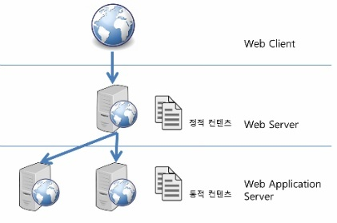

# Web System

[1. WEB (Web Server)](#1-web-web-server)  
[2. WAS (Web Application Server)](#2-was-web-application-server)  
[3. Web System](#3-web-system)

  
---

### 1. WEB (Web Server)

#### 1. 개념
- 웹 브라우저 클라이언트로부터 HTTP 요청을 받아 정적 컨텐츠를 제공하기 위한 서버
  
#### 2. 특징
- HTTP 를 기반으로 동작
- 파일 경로 이름을 통해 경로와 일치하는 file contents 반환
- 정적 리소스 제공, 기타 부가 기능 ex) HTML, CSS, JS, Image, Video
- ex) NGINX, APACHE 

#### 3. 기능
- HTTP 프로토콜을 기반으로 클라이언트의 요청을 서비스하는 기능
- WAS를 거치지 않고 바로 정적인 컨텐츠를 제공하는 기능
- 동적인 컨텐츠 제공을 위해 요청을 전달하는 기능
  - 클라이언트 요청 -> WEB -> WAS -> 처리 결과 -> 클라이언트
  
---

### 2. WAS (Web Application Server)

#### 1. 개념
- 애플리케이션 기능 (DB 조회, 비즈니스 로직) 이 필요한 동적 컨텐츠를 제공하기 위한 서버
- HTTP 를 통해 하드웨어 장치에 애플리케이션 로직을 수행하는 미들웨어
- '웹 컨테이너' 또는 '서블릿 컨테이너' 라고도 불린다.
- Web Server + Web Container
- 즉, 컨테이너 기능을 제공하면 WAS

#### 2. 특징
- HTTP 를 기반으로 동작
- 인자의 내용에 맞게 동적인 contents 반환
- WEB 기능 + 정적 리소스 제공 기능, 애플리케이션 로직 포함 
- 동적 HTML, HTTP API, Servlet, JSP, Spring MVC
- ex) Tomcat, Jetty, Undertow

#### 3. 기능
- Web Server 의 기능들을 구조적으로 분리하여 처리하는 기능
  - 분산 트랜잭션, 보안, 메시징, 쓰레드 처리 등의 분산 환경에서 사용
  - DB 서버와 함께 수행
- 프로그램 실행 환경과 DB 접속 기능
- 다중 트랜잭션 관리 기능
- 애플리케이션 코드 실행 기능 (비즈니스 로직 처리)
  
---

### 3. Web System 

#### 1. 웹 시스템 구조
1. WAS + DB
   - 장점 : 정적 리소스, 애플리케이션 로직 모두 WAS 에서 처리
   - 단점
     1) WAS 가 너무 많은 역할을 담당하면 서버 과부하 우려
     2) 비용이 큰 애플리케이션 로직이 정적 리소스 때문에 수행이 어려울 수 있음
     3) WAS 장애시 정적 콘텐츠 또한 제공 불가능 (오류 화면 등)
2) WEB + WAS + DB
   - 특징 : 정적 리소스는 웹 서버가 처리, 동적인 처리는 WAS에서 처리
   - 장점
     1) 효율적인 리소스 관리가 가능 (정적 리소스 사용량이 많다면 Web Server 증설, 애플리케이션 리소스 사용량이 많다면 WAS 증설)
     2) WEB 서버 장애가 날 확률이 낮음
  

#### 2. 웹 시스템 구조를 나눈 이유
1. Web Server 의 필요성
   - 정적인 컨텐츠만 처리하도록 기능을 나눠 서버의 부담을 줄일 수 있다.
   - 동적인 컨텐츠는 WAS 에 요청, 전달 받아 서버를 효율적으로 사용할 수 있다.

2. WAS 의 필요성  
   - Web Server 만 이용시 정적인 컨텐츠만 제공하기 때문에 클라이언트가 원하는 결과를 모두 미리 만들어 놓고 서비스를 해야 한다. -> 자원의 부족
   - Web Server 에서 요청을 받아 필요할 때만 데이터와 비즈니스 로직을 제공하여 자원을 효율적으로 사용할 수 있다.

3. 시스템 구조를 나눈 이유
   1) 기능 분리를 통해 서버 과부하 방지
   2) 자원을 효율적으로 이용하는 데에 용이
   3) 물리적 분리를 통해 보안 강화
   4) 확장성에 용이 : 로드 밸런싱, WEB 및 WAS 증설
   5) 장애 대응에 용이 : fail over , fail back 처리
   6) 배포 및 유지보수에 용이