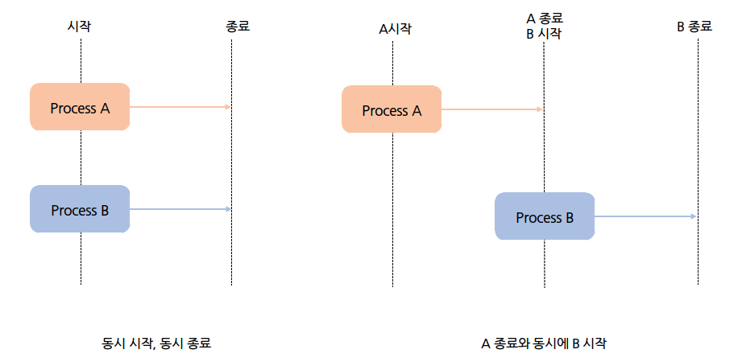
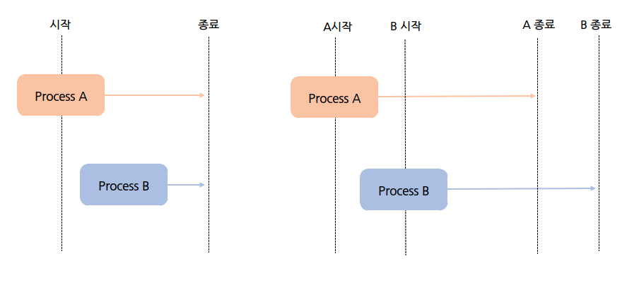

# Synchronous vs Asynchronous, Blocking vs Non-Blocking
<br>

## 1. Synchronous(동기)  vs Asynchronous(비동기)

### 1) 개념

우선 '동기'와 'Synchronous'의 어원부터 살펴보자. 한자로는 '同期'로, '같은 시각'이라는 뜻을 가진다. 이를 보면 얼추 이해할 수 있을 것 같지만, 꽤나 헷갈릴 수 있는 개념이기 때문에 영어의 어원도 함께 살펴보자. 우선 그리스어로 'Syn' 은 with, together인 '같이, 함께'의 뜻을 가진다. 다음으로 'chrono'는 '시각'의 뜻을 가진다. 즉, Syn + chrono + us 이 세 단어가 합쳐져 'Synchronous'가 완성된 것이다.

'Asynchronous'는 'Synchronous'에 반대를 나타내는 접두어인 'a'를 붙였다. 다시 말해 동기와 비동기는 반대의 개념이다. 이러한 개념을 바탕으로 동기와 비동기의 차이는 작업 시간을 함께 맞춰 진행하냐, 하지 않냐로 구분할 수 있다. 결국 동기와 비동기의 개념은 작업을 수행하는 주체가 두 개 이상일 때, 수행해야하는 작업들에 대한 흐름을 어떻게 처리해야 하는지에 대한 관점으로 생각하면 된다.
<br><br>

### 1) Synchronous (동기)

동기는 같은 시각에 처리되는 것, 특정 작업이 동시에 시작하거나, 동시에 끝나거나, 하나의 작업이 끝나는 동시에 다른 작업이 시작되는 것을 말한다. 이 때 작업 중에 다른 작업은 끼어들지 못한다. 이는 요청 작업에 대해 완료 여부를 따져 순차적으로 처리하는 것을 말한다.

요청 이후 응답을 받아야만 다음 작업이 이루어지며, 특정 작업을 처리할 동안 다른 작업들을 정지한다. 이러한 이유로 요청과 응답의 순서가 보장된다. 아래 그림을 보면 조금 더 이해가 쉽다.
<br>



<br>

코드를 예로 들면 실행의 흐름은 위에서 아래로 진행되며, 하나의 작업이 시작되면 해당 작업이 완료될 때까지 다음 작업은 대기한다.

함수를 호출한다면 함수의 실행이 끝나기를 기다리고, 그 결과를 받아야 다음 작업을 진행할 수 있는 것이다.
아래는 동기적으로 실행되는 간단한 코드 예제이다.
<br><br>

``````Java
// Java
public static void main() {
    System.out.println("task start");
    System.out.println("task proceed");
    System.out.println("task end");
}
``````
``````Javascript
// Javascript
console.log("task start");
console.log("task proceed");
console.log("task end");
``````
<br>

### 2) Asynchronous (비동기)

비동기는 동기의 반대이다. 요청 작업에 대해 완료 여부를 따져 순차적으로 처리하지 않고, 작업의 시작과 종료가 일치하지 않는다.
또한 동시에 시작하지 않음을 의미한다. 비동기는 작업들의 요청과 응답의 순서가 보장되지 않으며, 작업의 완료 여부를 신경쓰지 않는다. 

비동기적인 코드는 주로 콜백 함수, Promise, async/await 같은 메커니즘을 사용하며, 작업이 완료되면 특정 동작을 수행한다. 이를 통해 여러 작업을 동시에 진행하거나, 작업이 완료되기를 기다리지 않고 다른 작업을 처리할 수 있다.
<br><br>



아래는 비동기적으로 실행되는 간단한 코드 예제이다.

``````Java
// Java
public class Main {
    public static void main(String[] args) {
        // ExecutorService를 생성하여 스레드 풀 관리
        ExecutorService executorService = Executors.newFixedThreadPool(1);

        // 비동기 작업 정의
        Runnable otherTask = new OtherTask();
        executorService.execute(otherTask);

		// MainTask 비동기적 실행
        executorService.execute(() -> {
            try {
                System.out.println("MainTask");
                Thread.sleep(500);
            } catch (InterruptedException e) {
                e.printStackTrace();
            }
        });
        
        executorService.shutdown();
    }
}

class OtherTask implements Runnable {
    @Override
    public void run() {
        try {
            System.out.println("otherTask");
            Thread.sleep(500);
        } catch (InterruptedException e) {
            e.printStackTrace();
        }
    }
}
``````
``````JavaScript
// Javascript
console.log("task start");

// 'setTimeout' 함수는 비동기적으로 동작, 특정 시간 경과 후 콜백 함수 실행
setTimeout(function() {
    console.log("task proceed");
}, 1000);

console.log("task end");
``````
<br>

### 2) 장단점 비교

#### 1) Synchronous (동기)

장점
1. 직관적인 코드 : 동기 코드는 순차적으로 실행되기 때문에 코드의 흐름이 직관적임. 따라서 디버깅이나 코드 이해가 쉽다.
   
2. 동기적 에러 처리 : 에러가 발생하면 발생 지점에서 예외가 즉시 발생하기 때문에, 오류 처리가 상대적으로 간단하다.

3. 코드 일관성 : 동기 코드는 한 번에 하나의 작업을 처리하므로 데이터 일관성을 유지하기가 더 쉽다.

4. 단순한 구현 : 동기 코드는 비동기 코드에 비해 간단하게 구현할 수 있다.

5. 적은 컨텍스트 스위칭 비용 : 스레드 간의 컨텍스트 스위칭 비용이 적게 발생한다.
<br>

단점
1. 성능 제한 : 대규모 작업이나 여러 작업을 동시에 처리할 때 성능 저하 혹은 제한이 발생할 수 있다.

2. 대기 시간 발생 : 하나의 작업이 완료될 때까지 다음 작업이 대기하므로 대기 시간이 발생할 수 있다.

3. 자원 낭비 가능성 : 대기 시간동안 자원이 유휴 상태일 수 있으므로 효율적인 자원 관리가 어려울 수 있다.
 
4. 느린 응답 시간 : 모든 작업을 순차적으로 실행하기 때문에 응답 시간이 늘어날 수 있다.

5. 확장성 제한 : 동기 코드는 한 번에 하나의 작업만 처리하므로 확장성이 제한될 수 있다.
<br><br>

### 2) Asynchronous (비동기)

장점
1. 높은 성능 : 여러 작업을 동시에 처리할 수 있으므로 성능이 향상될 수 있다.

2. 대기 시간 감소 : 비동기 작업은 한 작업이 완료될 때까지 기다릴 필요가 없어 대기 시간이 감소한다.

3. 자원 효율성 증가 : 대기 시간 동안 다른 작업을 수행할 수 있으므로 자원의 효율적인 활용이 가능하다.

4. 빠른 응답 시간 : 비동기 작업은 병렬로 실행되므로 전반적인 응답 시간이 단축될 수 있다.

5. 확장성 : 비동기 코드는 여러 작업을 처리할 수 있으므로 확장성이 높다.
<br>

단점
1. 코드 복잡성 증가 : 비동기 코드는 콜백이나 Promise 등을 사용해 구현되기 때문에 코드가 복잡해질 수 있다.

2. 에러 처리의 어려움 : 동기 코드보다 에러 처리가 어려울 수 있다.

3. 콜백 지옥 : 비동기 중첩이 많아지면 콜백 지옥(Callback Hell)이 발생하여 코드 가독성이 떨어질 수 있다.

4. 비동기적 로직 이해의 어려움 : 코드의 실행 흐름이 순차적이지 않으므로 복잡한 로직을 이해하기 어려울 수 있다.

5. 동기 코드와 호환성의 어려움 : 동기 코드와 비동기 코드를 함께 사용할 때 호환성이 맞지 않아 문제가 발생할 수 있다.
<br><br>

## 2. Blocking vs Non-Blocking (블로킹 vs 논블로킹)

### 1) 개념

블로킹과 논블로킹은 동기/비동기와 혼동될 수 있으며, 명확한 개념을 모른다면 동일하다고 생각할 수도 있다. 하지만 관점을 달리 해야 한다. 앞서 동기/비동기는 '수행해야하는 작업들에 대한 흐름을 어떻게 처리해야 하는지에 대한 관점'이라고 했다. 

그렇다면 블로킹과 논블로킹은 '다른 요청의 작업을 처리하기 위해 차단해야 하는지, 대기해야하는지에 대한 관점'으로 생각하면 된다. 또한 작업을 수행하는 주체가 두 개 이상이어야 하는 동기/비동기와 다르게 블로킹/논블로킹은 작업의 대상이 두 개 이상이어야 한다.


